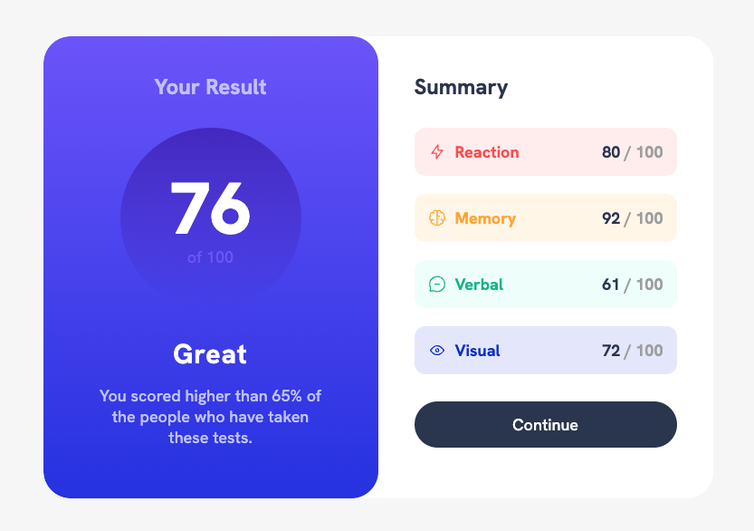

# Frontend Mentor - Results summary component solution

This is a solution to the [Results summary component challenge on Frontend Mentor](https://www.frontendmentor.io/challenges/results-summary-component-CE_K6s0maV). Frontend Mentor challenges help you improve your coding skills by building realistic projects.

## Table of contents

- [Overview](#overview)
  - [The challenge](#the-challenge)
  - [Screenshot](#screenshot)
  - [Links](#links)
- [My process](#my-process)
  - [What I learned](#what-i-learned)
- [Author](#author)

## Overview

### The challenge

Your challenge is to build out this results summary component and get it looking as close to the design as possible.

You can use any tools you like to help you complete the challenge. So if you've got something you'd like to practice, feel free to give it a go.

We provide the data for the results in a local `data.json` file. So you can use that to add the results and total score dynamically if you choose.

Your users should be able to:

- View the optimal layout for the interface depending on their device's screen size
- See hover and focus states for all interactive elements on the page

### Screenshot



### Links

- Solution URL: [Add solution URL here](https://your-solution-url.com)
- Live Site URL: [Add live site URL here](https://your-live-site-url.com)

## My process

### What I learned

Use this section to recap over some of your major learnings while working through this project. Writing these out and providing code samples of areas you want to highlight is a great way to reinforce your own knowledge.

To see how you can add code snippets, see below:

```css
.score {
  /* gradient circle */
  background-image: linear-gradient(
    hsla(256, 72%, 46%, 1),
    hsla(241, 72%, 46%, 0)
  );
  border-radius: 50%;
  padding: 4rem;
  margin: 0 auto 3rem auto;
  width: 200px;
  height: 200px;
  line-height: 1;
  position: relative;
}

.result-container {
  /* centering numbers in circle */
  position: absolute;
  margin: 0;
  top: 50%;
  left: 50%;
  transform: translate(-50%, -50%);
}
```

### Continued development

- flexbox
- grid
- css refinement

## Author

- Kells
